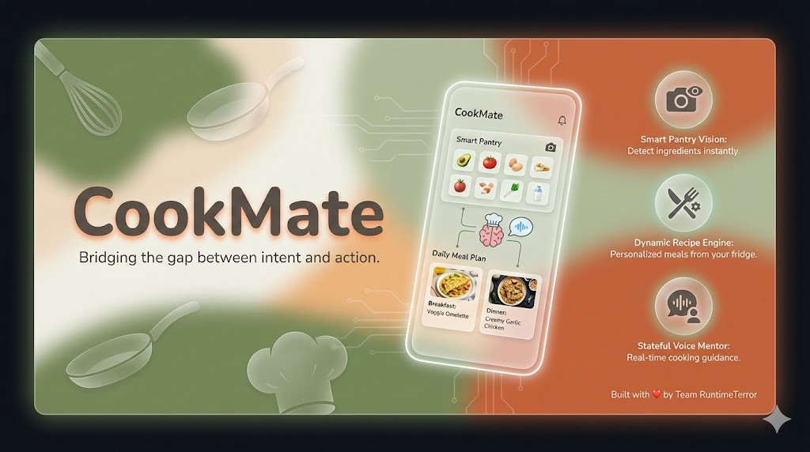
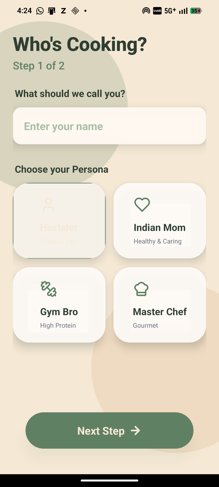
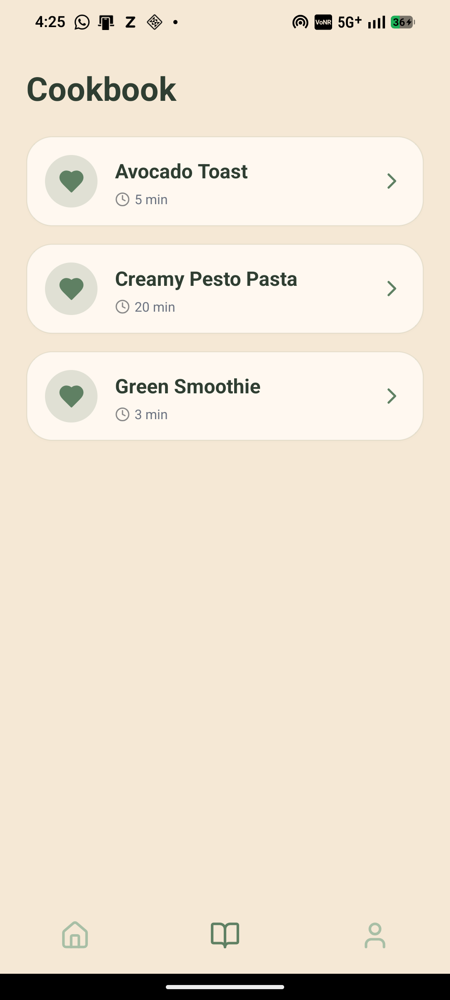

#  CookMate
> **Bridging the gap between intent and action.**



## The Problem
71% of Gen Z actively seek healthy options, but only **11% cook daily**. The intent is there, but the infrastructure is missing.
For young adults, the kitchen is a source of anxiety, decision fatigue, and the "Learning Tax"—the cost of not knowing how to manage ingredients, leading to **3x more spending on takeout**.

## The Solution
**CookMate** is an Intelligent Cooking Operating System. We don't just teach recipes; we prevent a decade of poor health outcomes.
* **Inventory Aware:** Snap a photo of your fridge; our AI tells you what to cook.
* **Persona-Driven:** Motivation that fits you (Gym Bro, Indian Mom, or Hosteler).
* **Zero Friction:** No subscriptions. No gated content.

## Key Features
- **Smart Pantry:** AI Computer Vision to detect ingredients from a single photo.
- **Dynamic Recipe Engine:** Generates recipes based on your specific inventory and effort level (Lazy vs. Chef).
- **Voice Mentor:** A stateful AI that guides you step-by-step (e.g., "Is the pan hot enough?").
- **Adaptive Personas:** AI personalities that change tone to keep you motivated.

## Screenshots
| Dashboard | Recipe Gen | Cooking Mode |
|:---:|:---:|:---:|
|  |  |  |

## 🛠️ Tech Stack
* **Frontend:** React Native, Expo, NativeWind (TailwindCSS)
* **Backend:** Python, FastAPI
* **AI/ML:** Computer Vision (Inventory), NLP (Recipe Generation)

## 👨‍💻 Team RuntimeTerror
* **Himanshu Patil** - Backend & AI Architecture
* **Aditya Gavane** - Frontend structuring, Scripting
## ⚙️ Installation & Setup

### Prerequisites
* Node.js & npm
* Python 3.9+
* Expo Go App (on your phone)

### 1. Backend Setup
```bash
cd backend
python -m venv venv
source venv/bin/activate  # or venv\Scripts\activate on Windows
pip install -r requirements.txt
uvicorn main:app --reload
CookMate/
├── backend/
│   ├── main.py            # FastAPI Routes & Business Logic
│   ├── models.py          # Database Models (SQLAlchemy)
│   ├── schemas.py         # Data Validation (Pydantic)
│   └── services/
│       └── ai_chef.py     # AI Engine & Vision Integration
├── frontend/
│   ├── screens/           # UI Screens (Home, Cooking, Profile, etc.)
│   ├── services/
│   │   └── api.js         # Axios API Configuration
│   └── components/
│       └── BottomTabs.js  # Global Navigation Component
└── README.md

